

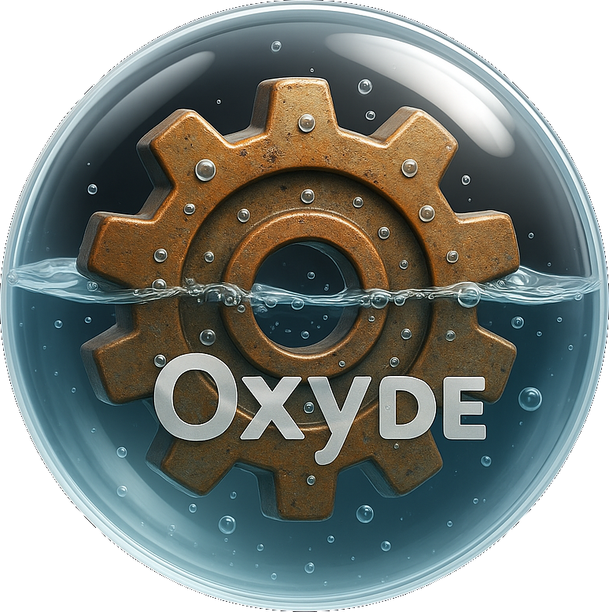 

# **Y2K Art**

Artwork inspired by Y2k era operating systems and aesthetics. To be used for Oxyde Desktop and LinX OS.

---

## **Wallpapers:**

 

---

## **Icons**

### [Standard](https://stock.adobe.com/search/images?k=retro+icons&ef_id=030a5d5f41171a0a872d35ae39003bf3%3AG%3As&s_kwcid=AL!3085!10!79371204151287!!!!2331170809744468!!506175911!1269937580510905&as_channel=sem&as_campclass=nonbrand&as_campaign=US_CPRO_STOCK_NONBRAND_ROI_CORE_DSA_STOCK_na_CROSS_DSA_na_BNG_EN&as_source=bing&as_camptype=acquisition&sdid=LZ32SSQD&mv=search&mv2=paidsearch&as_audience=core&msclkid=030a5d5f41171a0a872d35ae39003bf3&asset_id=477016611&continue-checkout%5B%5D=1&continue-checkout%5B%5D=1&token=EC-84984390EP732122D)

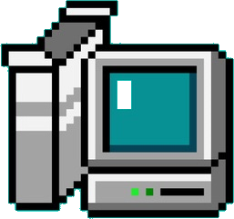
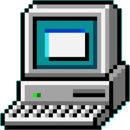
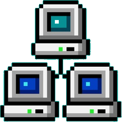
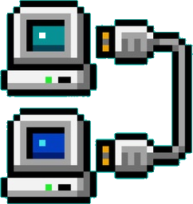
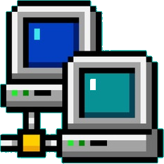
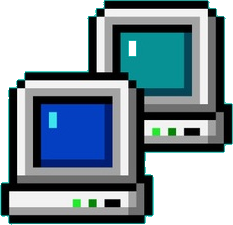
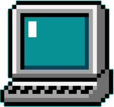
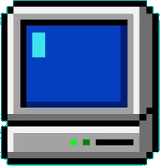
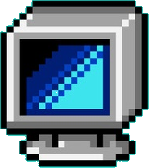
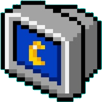
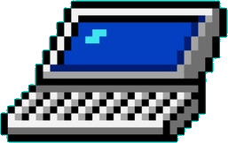
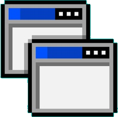

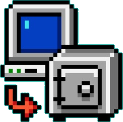
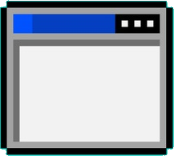
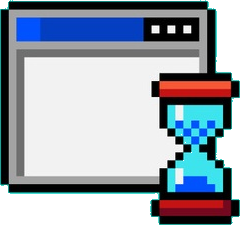
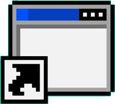
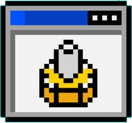
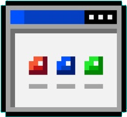
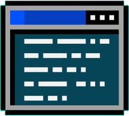
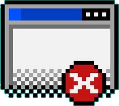
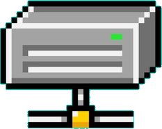
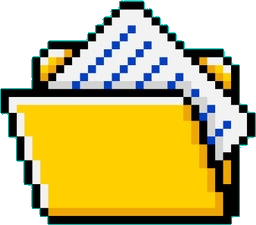

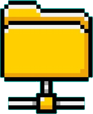

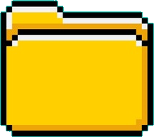
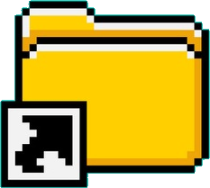
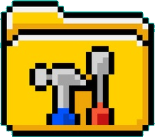
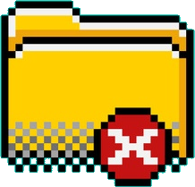
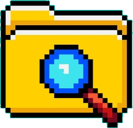
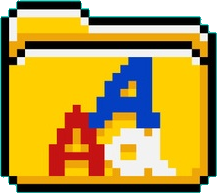
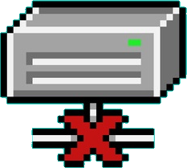
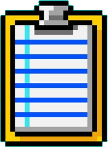
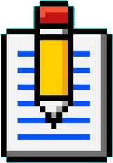

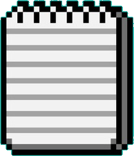
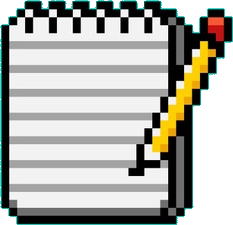
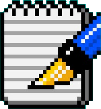
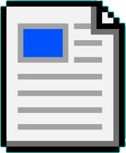

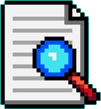
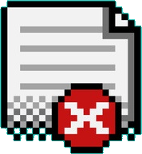
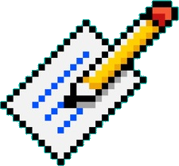
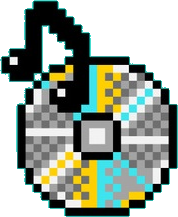
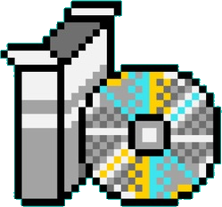
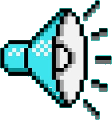
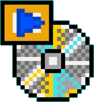
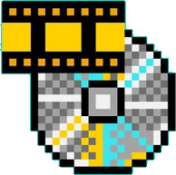
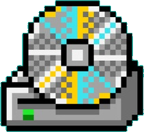
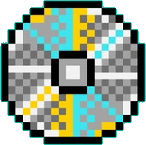

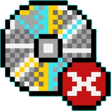
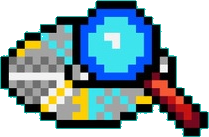
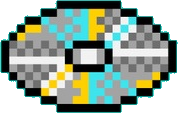

---

### Glass

**Coming Soon**

---

### Oxygen

*More Coming Soon*

---

**System**

---

**Apps**

---

**Tray**

---

## **Cursors**

# [Pixel](http://www.rw-designer.com/cursor-set/classic-1)

# [Smooth](http://www.rw-designer.com/cursor-set/antialiased-classic)

# [Glass](http://www.rw-designer.com/cursor-set/windows-7-aero-1)

# Oxygen

*Work in Progress*

---

## 📜 Licensing & Image Rights

This repository contains a mix of **original Oxyde artwork** and **third-party assets**.  
Please read this section carefully to understand what is protected and what is free to use.

### 🪞 Oxyde Original Artwork (Protected)
The following directories contain **original images and designs** created by the Oxyde team:

- `wallpapers/`
- `icons_glass/`
- `icons_oxygen/`
- `cursors/oxygen/`

All content within these folders is **copyright © 2025 Nicholas J. Chiaravalle**  
and is licensed under the terms of the included [`LICENSE`](./LICENSE) file  
(**OXYDE-NC-1.0** — Non-Commercial License).  

You **may not** use, redistribute, or modify these images for **commercial purposes**  
without written permission. Personal and non-commercial use is allowed with attribution.

### 🧩 Royalty-Free and Stock Assets
The folder `icons/` contains icons sourced from **Adobe Stock**.  
These are used under a **royalty-free license** that permits redistribution within open projects  
as long as the icons are not sold or re-licensed as standalone assets.

> Adobe Stock License Reference: [Adobe Stock Licensing Terms](https://www.adobe.com/legal/terms.html)

### 🌍 Public Domain / Open Assets
All other folders and files (unless otherwise noted) are considered **Public Domain (CC0)**  
or **royalty-free** works gathered from verified open-source repositories.  
These assets are free for commercial and personal use without attribution requirements.

### 🔗 Attribution and Sources
Full source links and attribution (where required) are listed in [`SOURCES.md`](./SOURCES.md).  
If you reuse or remix any content, please retain credit where applicable.

---

**Summary:**  
- ✅ You can freely use public and royalty-free folders.  
- 🛑 You cannot sell or monetize Oxyde wallpapers, glass icons, or cursors.  
- 💌 For commercial licensing or partnerships, contact: **chirv@oxy2k.org**.