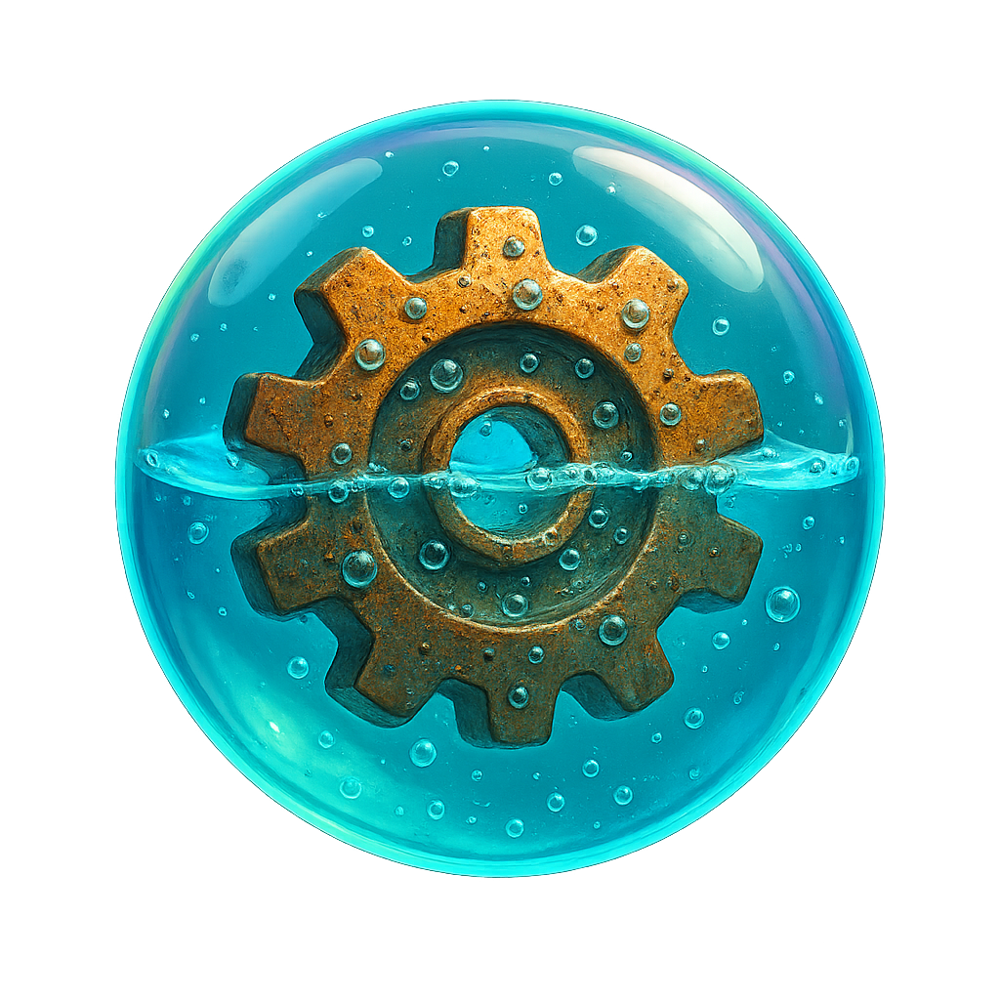
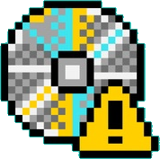
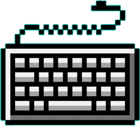
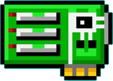
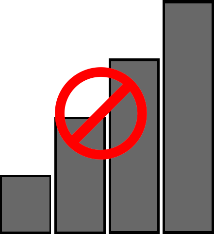
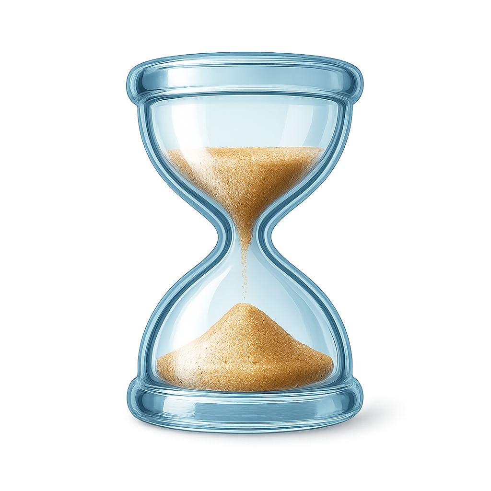

 

# **Y2K Art**

Artwork inspired by Y2k era operating systems and aesthetics. To be used for Oxyde Desktop and LinX OS.

---

## **Wallpapers:**

 

---

## **Icons**

### Standard

---

### Glass

**Coming Soon**

---

### Oxygen

*More Coming Soon*

---

**System**

---

**Apps**

---

**Tray**

---

## **Cursors**

# Pixel

# Smooth

# Glass

# Oxygen

*Work in Progress*

